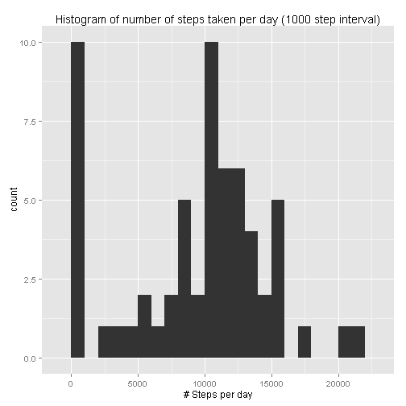
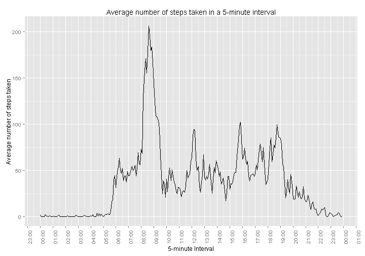
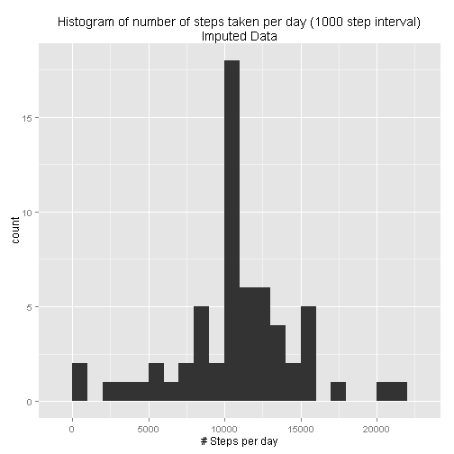
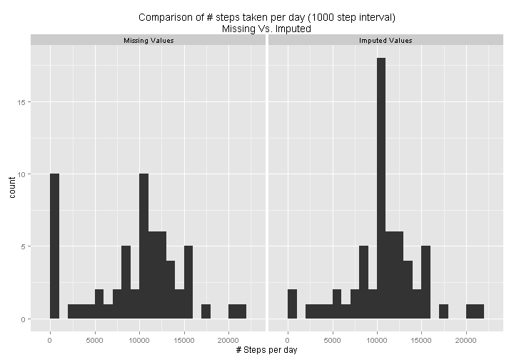
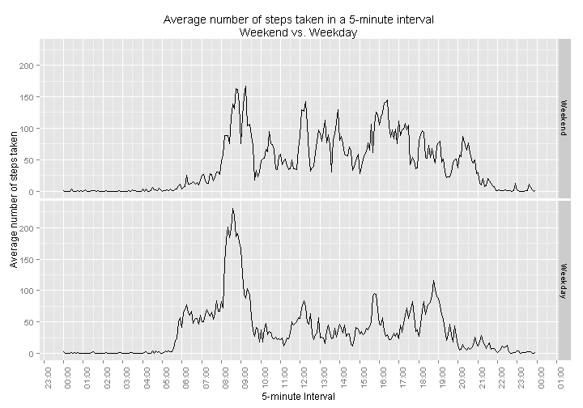

Reproducible Research: Peer Assessment 1
========================================

### Author: Shridhara Aithal

This report is compiled as part of the first peer assessment of Reproducible Research course offered by Johns Hopkins University on Coursera. It describes the findings of some basic analysis conducted on data collected by an individual using activity monitoring device. 

An activity monitoring device was used to record the number of steps taken by an individual at five minute intervals throughout the day. The data consists of two months worth of data collected at five minute intervals stored in a comma separated file. There are three variables in the dataset:

* **Steps**: Number of steps taken in the five minute interval, with missing values coded as NA
* **Date**: Date on which the recording was made in YYYY-MM-DD format
* **Interval**: The identifier of the 5-minute interval


## Loading and preprocessing the data

The data is in a compressed (zip) file. The first step is to uncompress the file to obtain the comma separated value file


```r
unzip("activity.zip")
```

We use the default value for overwrite parameter (which is TRUE), so that the comma separated file is always the latest. We then load the data into a dataframe and convert date from character class to date class.


```r
activity <- read.csv("activity.csv", stringsAsFactor = F)
activity$date <- as.Date(activity$date, "%Y-%m-%d")
```

To get an idea about the data we do a quick summary.


```r
summary(activity)
```

```
##      steps           date               interval   
##  Min.   :  0    Min.   :2012-10-01   Min.   :   0  
##  1st Qu.:  0    1st Qu.:2012-10-16   1st Qu.: 589  
##  Median :  0    Median :2012-10-31   Median :1178  
##  Mean   : 37    Mean   :2012-10-31   Mean   :1178  
##  3rd Qu.: 12    3rd Qu.:2012-11-15   3rd Qu.:1766  
##  Max.   :806    Max.   :2012-11-30   Max.   :2355  
##  NA's   :2304
```

The interval variable in the data is coded as HHMM, but is converted to numeric. For example, interval 00:00 (midnight) is 0, interval 01:30 is 130, and interval 10:55 is 1055. We now convert this to number of seconds since midnight so that when time series data is plotted, the scale on X axis is accurate. The value thus converted is added as a new column to the dataframe


```r
#Convert interval to date/time
activity$intervalsec <- strptime(formatC(activity$interval, width = 4, flag = "0"), format = "%H%M")

#Truncate date and store only seconds
activity$intervalsec <- as.numeric(activity$intervalsec - trunc(activity$intervalsec, "days"))
```

## What is mean total number of steps taken per day?
We now compute the total number of steps taken each day ignoring the missing values. We then find the frequency of number of steps taken with a 1000 step interval and visualize it using a histogram


```r
library(dplyr)
sumsteps <- summarize(group_by(activity, date), ss = sum(steps, na.rm = T))

library(scales)
library(ggplot2)
qplot(ss, data = sumsteps, geom = "histogram", binwidth = 1000, xlab = "# Steps per day",
      main = "Histogram of number of steps taken per day (1000 step interval)")
```

 

```r
mn <- mean(sumsteps$ss)
md <- median(sumsteps$ss)
```

The average number of steps taken each day is **9354.23** and median of the number of steps taken each day is **10395**.

## What is the average daily activity pattern?

We now compute the average number of steps taken in a given five minute interval across all days. This helps us visualize the most active five minute interval in a given day. Instead of using the original interval variable, we use the computed intervalsec variable and format X axis labels as time.


```r
dailyactivity <- summarize(group_by(activity, intervalsec), ms = mean(steps, na.rm = T))
dailyactivity$xl <- as.POSIXct(trunc(Sys.time(), "days") + dailyactivity$intervalsec)
qplot(x = xl, y = ms, data = dailyactivity, geom = "line", xlab = "5-minute Interval", 
      ylab = "Average number of steps taken", 
      main = "Average number of steps taken in a 5-minute interval")+
      scale_x_datetime(labels=date_format("%H:%M"), breaks = date_breaks(width = "1 hour"))+
      theme(axis.text.x = element_text(angle = 90))
```

 

```r
#Finding out the interval with the maximum average steps
maxstep <- dailyactivity[dailyactivity$ms == max(dailyactivity$ms),]
ivl <- format(maxstep[[1,"xl"]], "%H:%M")
avs <- round(maxstep[[1,2]], 2)
```
From the figure we see that the maximum aveage steps taken in a day is around 8:30 AM. To be precise, we see that the interval **08:35** has the maximum average steps of **206.17** in a given day.

## Imputing missing values

```r
#Finding out the number of missing values
tnas <- sum(is.na(activity$steps))
```
So far, we have been using the data by ignoring the missing values. In total there are **2304** missing values. In some cases, missing values may introduce bias/skew in the data and thus it may be beneficial to impute the missing values.

We impute the missing value in a given 5-minute interval by substituting the missing value with the average steps taken in that 5-minute interval. For example, if interval 0100 has average number of steps as 140 (computed by ignoring the missing values), we substitute all missing values in interval 0100 with 140.


```r
#Copy the original dataset to a new dataset and impute the values
fa <- activity
for(i in 1:nrow(dailyactivity))
{
    fa[fa$intervalsec == dailyactivity[[i, "intervalsec"]] & is.na(fa$steps), "steps"] <- 
                trunc(dailyactivity[i,"ms"])
}
```

We now compute the total number of steps taken each day from the imputed dataset. We then find the frequency of number of steps taken with a 1000 step interval and visualize it using a histogram


```r
sumstepsfa <- summarize(group_by(fa, date), ss = sum(steps, na.rm = T))
qplot(ss, data = sumstepsfa, geom = "histogram", binwidth = 1000, xlab = "# Steps per day",
      main = "Histogram of number of steps taken per day (1000 step interval)\nImputed Data")
```

 

```r
mni <- mean(sumstepsfa$ss)
mdi <- median(sumstepsfa$ss)
```

In the imputed dataset, the average number of steps taken each day is **10749.77** and median of the number of steps taken each day is **10641**. We recall that the average and median when missing values are ignored are **9354.23** and **10395**, respectively.

Finally we plot the histograms of "averages ignoring missing values" and "averages with imputed values" to show comparison of the changes


```r
sumstepsfa$type <- "Imputed Values"
sumsteps$type <- "Missing Values"
allsums <- rbind(sumsteps, sumstepsfa)
allsums$type <- factor(allsums$type, levels = c("Missing Values", "Imputed Values"))
qplot(ss, data = allsums, geom = "histogram", binwidth = 1000, facets = . ~ type, 
      xlab = "# Steps per day",
      main = "Comparison of # steps taken per day (1000 step interval)\nMissing Vs. Imputed")
```

 

In the above plots it is evident that the number of steps in the first bin has reduced drastically in the imputed-value plot while the number of steps in the bin that contains the mean has increased. This is because we substituted mean for missing values.

## Are there differences in activity patterns between weekdays and weekends?
We now examine if there are any differences in activity battern between weekdays and weekends. We consider imputed data for this computation. First, we add a new factor variable, with two levels: Weekend and Weekday, to the dataset. We then compute the average steps taken in each 5-minute intervals across all week days and weekend days and then plot the result.


```r
fa$daytype <- factor(ifelse(weekdays(fa$date) == "Saturday" | weekdays(fa$date) == "Sunday", 
                            "Weekend", "Weekday"), levels = c("Weekend", "Weekday"))

dayactivity <- summarize(group_by(fa, daytype, intervalsec), ms = mean(steps, na.rm = T))
dayactivity$xl <- as.POSIXct(trunc(Sys.time(), "days") + dailyactivity$intervalsec)
qplot(x = xl, y = ms, data = dayactivity, geom = "line", xlab = "5-minute Interval", 
      facets = daytype ~ ., ylab = "Average number of steps taken", 
      main = "Average number of steps taken in a 5-minute interval\nWeekend vs. Weekday")+
      scale_x_datetime(labels=date_format("%H:%M"), breaks = date_breaks(width = "1 hour"))+
      theme(axis.text.x = element_text(angle = 90))
```

 

From the plot, we see that on weekends, the average number of steps taken tends to be spread throughout the day, whereas on week days, the number spikes in the morning and in the evening. We can possibly attribute this to the fact that people generally tend to be active throughout the day on weekends in contrast to weekdays.

### * * * End of Report * * * 


